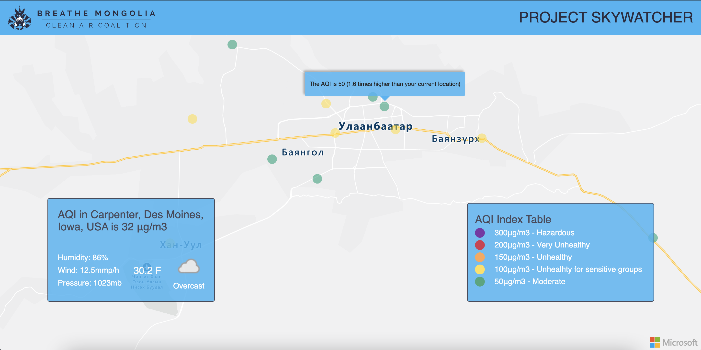

# Project Sky Watcher Version 1.0 

Project Sky Watcher is a collaborative platform that uses affordable embedded Iot devices to calculate air qualities around Mongolia aiming to allow citizen led actions and collaborate with other organizations about air quality issues.

## Demo

This demo shows Mongolia's live Air pollution data coming from our sensors placed indoor and outdoor. Using the users connected IP address, we show the comparison between user's current geolocation AQI and designated Mongolia's location to demonstrate how much degree difference in air pollution. 

Click [here](https://skywatcher.azurewebsites.net/) to see it in live action!



## IoT Devices

We use Microsoft IoTHub to handle the incoming data coming from sensors in Mongolia. The air pollution sensor devices were created by our team member [Baagii](https://ieeexplore.ieee.org/author/37088549561) at BYU last year. Microsoft Sphere is fully feasible solution in this case. You can find more information about our sensors [here](https://ieeexplore.ieee.org/document/9249214/authors#authors).

## Installation

To run the project locally, you need:
 - Python 3.6 or higher installed, and available on your path
 - Visual Studio Code or any other IDE installed
 - Python virtual environment
 
 To start a python virtual environment:
 
 On windows, run: 
 
 ```python -m venv .venv```
 
 On Linux and macOS, run: 
 
 ```python3 -m venv .venv```
 
 And lastly install the required packages for the flask App to run:
 
 ```pip install -r requirements.txt```
 
 ## Stack
 
 We used Python Flask for the project. We have ```app.py``` file for the API calls and ```templates/home.html``` to render the visual map.


## Contributing
Feel free to contribute to this project. Pull requests are welcome. For major changes, please open an issue first to discuss what you would like to change.

## License
[MIT](https://choosealicense.com/licenses/mit/)
